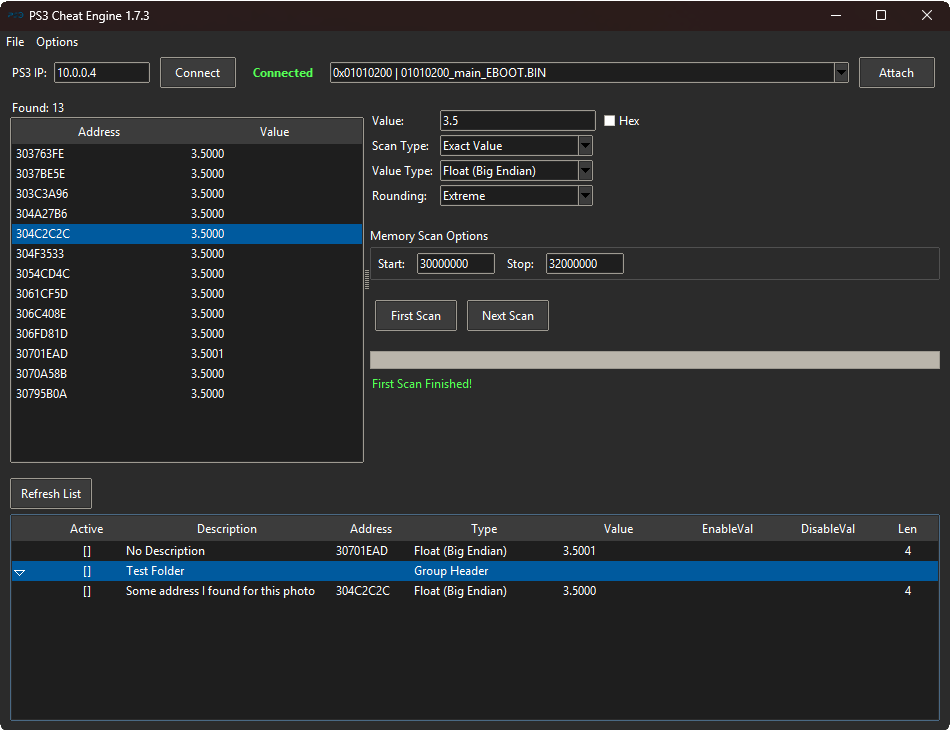
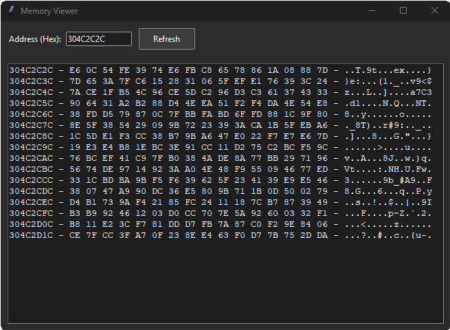
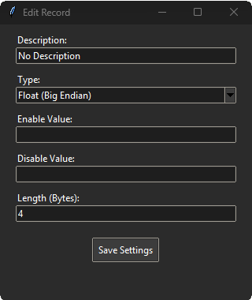

# PS3 Cheat Engine 1.7.3

A high-performance memory manipulation suite for PlayStation 3 consoles. This tool acts as a bridge between your PC and the PS3, enabling real-time scanning, value editing, and cheat table management via `webMAN-MOD` and `PS3MAPI`.


## 🧠 Technical Architecture
The engine is architected to balance ease-of-use with raw speed:

* **Frontend (Python/Tkinter):** Handles the user interface, configuration settings, and XML cheat table parsing.
* **Performance Backend (C++ DLL):** The `scanner_core.dll` is the powerhouse. When you perform a "First Scan" or "Next Scan," Python offloads the heavy memory processing to C++. This prevents the GUI from hanging and allows for millions of memory addresses to be checked in milliseconds.
* **Communication Layer (`PS3MAPI.py`):** Acts as a network bridge using a standard TCP socket protocol. It interfaces directly with the `webMAN-MOD` server on your PS3, sending memory read/write commands as binary packets.
* **Data Persistence:** The `config_manager.py` handles input/output for settings. It serializes your preferences (IP, theme, paths) into a `config.json` file. 

## 📸 Interface Guide

| Main UI | Memory Viewer | Cheat Table Editor |
| :---: | :---: | :---: |
|  |  |  |

* **Main UI:** Control center for scanning processes and managing connection states.
* **Memory Viewer:** Provides a raw hex-dump view of PS3 memory offsets. Essential for debugging pointers and finding specific data structures.
* **Cheat Table Editor (Record):** Manage your "Cheat Table" collection. When you "Record" or edit a value here, the engine pushes that write-command directly to the PS3's RAM.

## 🛠️ Usage Documentation

### 1. Setup
1.  **Configure:** On the first run, the tool generates a `config.json`. Edit this file to add your PS3 IP (e.g., `10.0.0.4`).
2.  **Attach:** Open the PS3 Cheat Engine, ensure your console is running `webMAN-MOD`, and click **Attach** to select your game process.
3.  **File Association:** Run `register_extension.py` as an **Administrator** to associate `.ps3ct` files. This allows you to simply double-click your saved tables to launch them directly into the engine.

### 2. Performing a Scan
1.  **Scan:** Enter a value, select your data type, and click **First Scan**.
2.  **Refine:** Perform an in-game action (e.g., spend ammo), enter the new value, and click **Next Scan**.
3.  **Edit:** Once the list of addresses is filtered down, select the address to "freeze" or modify the value.

### 3. Building from Source
If you are modifying the code, you can rebuild the executable:

1.  Ensure you have Python 3.12 (32-bit) installed.
2.  Navigate to the `PS3 Cheat Engine/` directory.
3.  Run the build command:
    ```bash
    py -3.12-32 -m PyInstaller PS3CheatEngine.spec
    ```
*Note: Ensure `scanner_core.dll` and `icon.ico` remain in the same directory as your final .exe file, or the program will fail to initialize.*

## 📁 File Manifest
* `Main.py`: GUI initialization and event loop.
* `scanner_engine.py`: Manages the bridge between Python and `scanner_core.dll`.
* `PS3MAPI.py`: The network socket protocol implementation.
* `table_manager.py`: XML logic for saving/loading `.ps3ct` files.
* `config_manager.py`: Handles reading/writing the `config.json` settings.
* `scanner_core.dll`: The C++ backend binary for optimized scanning.

---
*Built for the PS3 community.*
